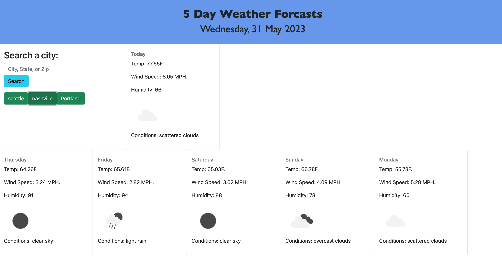

# My-Weather-Dashboard
Landing page for 5 day forcast.

  ## Description

  This is an app for finding the weather in your local city. Search a city and get current weather and 5 day forcasts. 

  ## Table of Contents

  - [Installation](#installation)

  - [Usage](#usage)

  - [Credits](#credits)

  - [License](#license)

  - [Features](#features)

  - [Contribution](#contribution)

  - [Tests](#tests)

  ## Installation

  There are no installation procedures for this app. Click the link to access the deployed version in the web browser.

  ## Usage

  This app is designed to find weather based on city search. Local storage is implemented to save past search history. 

  ## Credits

  Open Weather Map API

  ### [Github](https://github.com/jbungurait)
  ### [Email](mailto:jbungurait@gmail.com;)
  ### [LinkedIn](https://www.linkedin.com/in/josh-ungurait-0045b352/)

  ## License

  This project licensed under MIT License .

  ## Features

  This app features an API call, local storage, and Bootstrap for styling. 

  ## Contribution

  Feel free to email with any updates on how this app could be improved!

  ## Tests 

  Testing will be done through execution of the app before deployment.

  ## Images
  